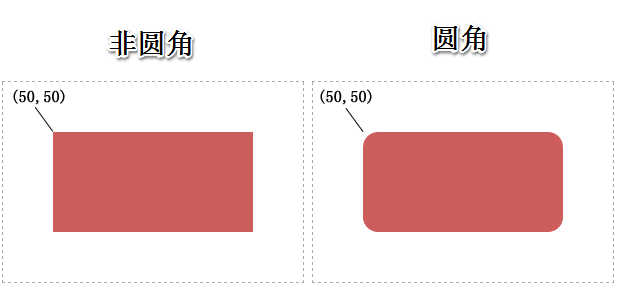
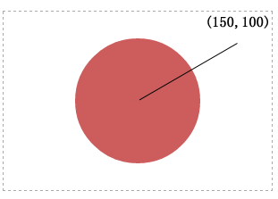
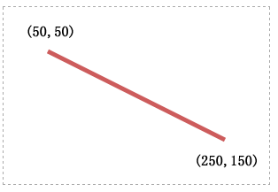
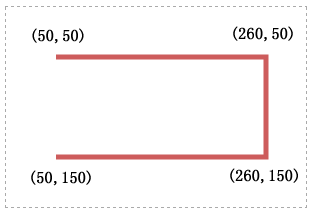
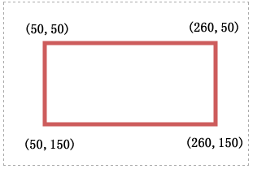

# SVG 基础图形 #

SVG包含了以下的基础图形元素：

- 矩形（包括可选的圆角），使用`<rect>`元素创建
- 圆形，使用`<circle>`元素创建
- 椭圆形，使用`<ellipse>`元素创建
- 直线，使用`<line>`元素创建
- 折线，使用`<polyline>`元素创建
- 多边形，使用`<polygon>`元素创建

理论上，这些基础图形元素都能用`<path>`元素来构建的相同的图形。并且所有可用于`<path>`元素的属性都可以应用在这些基础图形上。

## rect 元素 ##
`<rect>`元素定义了一个与当前用户坐标系轴对齐的矩形。而圆角的矩形可以通过设置元素的 `rx` 和 `ry`属性来实现。

**属性定义：**

- x = `<坐标点>`，矩形左上角在当前用户坐标系中的x轴坐标，默认值为0。是否可动画：是。
- y = `<坐标点>`，矩形左上角在当前用户坐标系中的y轴坐标，默认值为0。是否可动画：是。
- width = `<长度>`，矩形宽度，默认值为0。是否可动画：是。
- height = `<长度>`，矩形高度，默认值为0。是否可动画：是。
- rx = `<长度>`，矩形X轴的圆角半径，默认值为0。是否可动画：是。
- ry = `<长度>`，矩形y轴的圆角半径，默认值为0。是否可动画：是。

**圆角规则：**

1. rx和ry必须是一个长度值。
2. 如果没有对rx和ry给出定义，那么它们都会被设为0。 (这样他们会是一个尖角的矩形)
3. 如果只对rx进行了赋值，那么ry会自动被设置为与rx相等的值。
4. 如果只对ry进行了赋值，那么rx会自动被设置为与ry相等的值。
5. 如果rx的值大于自身宽度的一半，那么它会被设置为自身宽度一半。
6. 如果ry的值大于自身高度的一半，那么它会被设置为自身高度一半。

**DEMO：**

	<svg xmlns="http://www.w3.org/2000/svg" width="300" height="200" viewBox="0 0 300 200" style="border:1px dashed #aaa;">
	    <rect x="50" y="50" width="200" height="100" fill="#cd5c5c"></rect>
	</svg>
	<svg xmlns="http://www.w3.org/2000/svg" width="300" height="200" viewBox="0 0 300 200" style="border:1px dashed #aaa;">
		<rect x="50" y="50" rx="15" ry="15" width="200" height="100" fill="#cd5c5c"></rect>
	</svg>

## circle 元素 ##
`<circle>`元素定义了一个圆形。

**属性定义：**

- cx = `<坐标点>`，圆心在当前用户坐标系中的x轴坐标，默认值为0。是否可动画：是。
- cy = `<坐标点>`，圆心在当前用户坐标系中的y轴坐标，默认值为0。是否可动画：是。
- r = `<长度>`，圆的半径。是否可动画：是。

## ellipse 元素 ##
`<ellipse>`元素定义了一个椭圆。

**属性定义：**

- cx = `<坐标点>`，圆心在当前用户坐标系中的x轴坐标，默认值为0。是否可动画：是。
- cy = `<坐标点>`，圆心在当前用户坐标系中的y轴坐标，默认值为0。是否可动画：是。
- rx = `<长度>`，圆的x轴半径。是否可动画：是。
- ry = `<长度>`，圆的y轴半径。是否可动画：是。

**DEMO：**

	<svg xmlns="http://www.w3.org/2000/svg" width="300" height="200" viewBox="0 0 300 200" style="border:1px dashed #aaa;">
    	<circle cx="150" cy="100" r="70" fill="#cd5c5c"></circle>
  	</svg>

## line 元素 ##
`<line>`元素定义了一个处于两点之间的直线。

**属性定义：**

- x1 = `<坐标点>`，起点在当前用户坐标系中的x轴坐标，默认值为0。是否可动画：是。
- y1 = `<坐标点>`，起点在当前用户坐标系中的y轴坐标，默认值为0。是否可动画：是。
- x2 = `<坐标点>`，终点在当前用户坐标系中的x轴坐标，默认值为0。是否可动画：是。
- y2 = `<坐标点>`，终点在当前用户坐标系中的x轴坐标，默认值为0。是否可动画：是。

因为line元素在几何关系上是一个一维的图形，所以它没有内部的这个概念，也无法在该元素上使用`fill`属性。

**DEMO：**

	<svg xmlns="http://www.w3.org/2000/svg" width="300" height="200" viewBox="0 0 300 200" style="border:1px dashed #aaa;">
		<line x1="50" y1="50" x2="250" y2="150" stroke-width="5" stroke="#cd5c5c" />
	</svg>

## polyline 元素 ##
`<polyline>`元素定义了一个由多条相连的直线段而成的非闭合图形。

**属性定义：**

- points = `<多组的坐标点>`，由points属性中的坐标点相连而成的图形。

**DEMO：**

	<svg xmlns="http://www.w3.org/2000/svg" version="1.1" width="300" height="200" viewBox="0 0 300 200" style="border:1px dashed #aaa;">
		<polyline fill="none" stroke="#cd5c5c" stroke-width="5" points="50,50 260,50 260,150 50,150" />
	</svg>

## polygon 元素 ##
`<polygon>`元素定义了一个由多条相连的直线段而成的闭合图形。

**属性定义：**

- points = `<多组的坐标点>`，与`<polyline>`元素相同，也是由points属性中的坐标点相连而成的图形，但起始点也会相连。

**DEMO：**

	<svg xmlns="http://www.w3.org/2000/svg" version="1.1" width="300" height="200" viewBox="0 0 300 200" style="border:1px dashed #aaa;">
		<polygon fill="none" stroke="#cd5c5c" stroke-width="5" points="50,50 260,50 260,150 50,150" />
	</svg>

