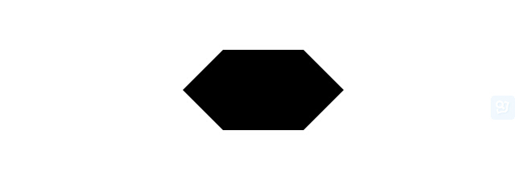
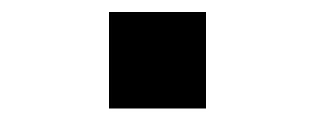

# inline SVG 入门指南 #

> 原文地址：[http://marketblog.envato.com/learn-something-new/getting-started-inline-svg/](http://marketblog.envato.com/learn-something-new/getting-started-inline-svg/)

SVG stands for “scalable vector graphics”, and the name itself is very suggestive. SVG gives us the power to scale a graphic from 100% to 1000% without losing any quality at all. An SVG file is all XML, and is a declaration of various shapes and paths inside an SVG object. Each of these shapes/paths consists of a collection of points, positions, lengths, radius, etc., depending on the shape type. If you’ve ever worked in any vector graphics software (like Adobe Illustrator or Corel Draw), you’ve created vector graphics that can be easily outputted as SVG.

SVG全称为“可缩放矢量图形”，它的名字暗示着它本身的特点。SVG让我们可以将一个图形从100%放大到1000%并且完全不失真。SVG是一个基于XML并可以在SVG对象中描述不同形状和路径的文件。每一个形状和路径都由一系列的点、位置、长度、半径，等等的来组成。如果你曾经使用过任何的矢量图软件 (像 Adobe Illustrator 或 Corel Draw)，你能将你创建的矢量图轻松地输出为SVG文件。

It’s been particularly useful and commonplace for things like icons, because we can use one small SVG file and scale it to bigger sizes without any loss. SVG support and power has been growing quite rapidly in the web though, and libraries like Snap.svg have given us the ability to create some amazing stuff. Today though, I’m going to get into some basics, and show you some really cool things that can be achieved with SVG, covering basic implementations, element creation, and attribute manipulation.

SVG对一些常见的东西来说是非常有利的，例如图标，因为我们可以用一个小的SVG文件并将其缩放到更大的尺寸而不造成任何的失真。互联网中，SVG的发展非常地迅速，像[Snap.svg](http://webdesign.tutsplus.com/articles/how-to-manipulate-and-animate-svg-with-snapsvg--cms-21323)这个库已经可以让我们创建出一些令人惊讶的东西。而今天，我要讲一些基础的东西，以及展示一些使用SVG实现的酷炫效果，包括一些基本的实现、元素的创建和属性的操纵。

## 使用内联SVG ##
下面是SVG三种主要的实现方式：

1. SVG作为背景图片使用
2. SVG作为`src`属性使用
3. 内联SVG

The first two are basic and very common implementations of SVG. You have your SVG file, and you link to it like you would to any other media file. The third – inline SVG – will be the focus of this tutorial. Inline SVG spits out all of our XML data directly in our document, and allows us to access the various elements via CSS and JavaScript.

前两种是SVG非常基础和普通的实现方式，就像其他媒体元素一样你可以把你的SVG文件链接到页面中。第三种——内联SVG——是本文的重点。内联SVG直接在文档中包含了所有的XML数据，并且允许我们通过CSS和Javascript来访问它们。

This gives us great control over manipulation of things like fill, stroke, position, opacity, and a host of other properties and attributes. Let’s take a look at how we declare a new inline SVG element, and the creation of a few basic shapes.

这给予了我们很大的控制权来操作SVG，如通过fill、stroke、position、opacity和其他各种属性来改变它的外貌和特征。现在我们来看看如何声明一个内联SVG元素，以及一些基本形状是如何创建的。

## 声明一个SVG元素 ##
Because SVG is an XML markup language, we need to declare the namespace for our SVG element. You can take a look at the MDN page about namespaces here, but in a nutshell, we’re looking at something like this:

因为SVG是一个XML标记语言，我们需要为我们的SVG元素声明一个命名空间。你可以看看这篇MDN上关于命名空间的文档。但总而言之，我们会看到这么一段代码：

	<svg xmlns="http://www.w3.org/2000/svg">
	  <!--  svg stuff here  -->
	</svg>

There’s a host of other attributes that we can declare, but for now, we’re going to look at these three:

我们可以声明的属性有很多，但现在，我们先看看下面这三个：

1. width——这个值代表着用户坐标系中水平方向的长度。
2. height——这个值代表着用户坐标系垂直平方向的长度。
3. View box——这个值允许我们指定一组图像伸展开来适应一个特定的容器元素。`viewBox`属性的值是一个包含四个数字的列表。`min-x`,`min-y`,`width`,`height`。

现在，我们的SVG元素看起来像是这样：

	<svg xmlns="http://www.w3.org/2000/svg" width="400" height="300" viewBox="0 0 400 300">
	 <!--  svg stuff here  -->
	</svg>

For a full list of attributes, check the attribute reference on MDN. Let’s create some shapes now!

如果你想查看所有的属性，请阅读MDN上的[属性参考](https://developer.mozilla.org/en-US/docs/Web/SVG/Attribute)文档。现在让我们来创建一些图形吧！

## 创建SVG图形 ##

Now that we’ve declared our SVG with some useful attributes, it’s time to create some shapes. There’s a host of elements that we can now include inside our svg tag, but we’re going to look at four common elements in this tutorial:

现在我们上面的SVG已经声明了一些有用的属性，是时候去创建一些图形了。能包含在`svg`标签里的元素有一大堆，但在这篇文章中我们先看看最常见的四种元素：

1. `circle` — 基础图形，基于中心点以及半径来创建的圆形。
2. `rect` — 基础图形，基于角的位置和矩形的宽度和高度来创建的矩形。
3. `polygon` — 基础图形，基于坐标点和两点相连而成的直线线段来创建的多边形。
4. `path` — 万能的图形，可以用来创建任意的形状。所有基础图形都能由它来创建。

### 圆形Circle ###

With the circle element, we have 3 specific attributes. They are cx, cy, and r. cx and cy are the x and y-axis coordinates of the centre of the element, and they default to zero if they aren’t specified. r is the radius of the circle. We may then have some markup looking like this:

对于`circle`元素，我们有3个需要指定的属性。它们是`cx`，`cy`，`r`。`cx`和`cy`是圆心在X轴和Y轴上的坐标，如果没有指定的话，它们的默认值为0。`r`为圆形的半径。一般来说，对一个圆形元素来说我们可以看到如下的标签：

	<svg xmlns="http://www.w3.org/2000/svg" width="100" height="100" viewBox="0 0 100 100">
	  <circle cx="50" cy="50" r="50"></circle>
	</svg>

浏览器渲染输出后的效果：

### 矩形Rect ###

Using the rect element is just as intuitive as the circle element. In it’s most basic form, we specify the x and y position of the top left corner, and specify the width and height. Our markup may look like this:

矩形的创建跟圆形的创建方式差不多。就它最基础的形式来说，我们需要为其指定左上角的的坐标x和y，以及该矩形的宽度`width`和高度`height`的值。其标签如下所示：

	<svg xmlns="http://www.w3.org/2000/svg" width="200" height="100" viewBox="0 0 200 100">
	  <rect x="0" y="0" width="200" height="100"></rect>
	</svg>

渲染输出后：

### 多边形Polygon ###

We define our polygon element by a collection of x-y coordinates listed inside the points attribute. These coordinates are connected in order via straight line segments. We may have some markup looking like this:

我们可以通过在`points`属性上的多组 x-y 坐标点来定义我们的多边形元素。这些坐标点通过直线线段来连接。标签声明如下：

	<svg xmlns="http://www.w3.org/2000/svg" width="200" height="200" viewBox="0 0 200 100">
	  <polygon points="0,50 50,0 150,0 200,50 150,100 50,100"></polygon>
	</svg>

渲染输出后：

### 路径Path ###
The path element is the most powerful element at our disposal as far as shapes go. Inside the path element, we can define our d attribute, which is the definition by which the path follows. The d attribute let’s us specify certain movements by using a series of commands. We can use line commands and curve commands to construct complex shapes. In reality, you’ll probably not want to write out cubic Bezier’s by hand, but create them in a vector graphics program and export the SVG. But it’s still good to know what’s going on.

`path`元素是在形状处理方面最强大的元素。在`path`元素中，我们可以定义`d`属性，这个属性为我们的路径如何延伸作出了定义。`d`属性可以让我们通过一系列的命令来指定一个运动轨迹。我们可以用直线命令和弯曲命令来构建一些复杂的形状。但实际上，你并不希望手写贝塞尔曲线这种玩意，二是通过矢量软件来创建并输出SVG。但了解一下他们并不是什么坏事。

Let’s create a simple square using some line commands. At our disposal, we have:

让我们通过直线命令来创建一个简单的矩形。我们需要的命令如下：

- M x y — 移动到坐标x-y
- L x y — 从当前位置画一条直线到坐标x—y
- H x — 从当前位置画一条水平线到坐标x
- V y — 从当前位置画一条垂直线到坐标y
- Z — 闭合路径

把上面的命令记住后，我们可以通过下面的代码来构建一个简单的矩形：

	<svg xmlns="http://www.w3.org/2000/svg" width="200" height="200" viewBox="0 0 200 200">
	  <path d="M 0 0 H 200 V 200 H 0 Z"></path>
	</svg>

We started at (0 0), moved horizontally to (200 0), moved vertically to (200 200), moved horizontally to (0 200), and closed the path. Our output looks like this:

我们从坐标(0，0)出发，水平运动到坐标(200,0)，垂直运动到坐标(200,200)，再水平移动到坐标(0,200)，最后闭合路径。我们的输出的图形如下所示：

Creating curves is a slightly more complicated procedure. But at our disposal, we have cubic Bezier’s, quadratic curves, and arcs. As an example, let’s look at the building of a cubic Bezier.

创建曲线要比上面稍微复杂一些。对于SVG来数，存在贝塞尔曲线、二次曲线和弧线。让我们来看看如何构建一个贝塞尔曲线。

At this point, if you want to learn more about Bezier curves and how they are constructed, I suggest you read this reference. But as a quick summary, a cubic Bezier curve is defined by a start point, an end point, a two coordinate sets to which we draw tangential lines from the start and end points (yay Mechanical Engineering degree!). In our construction of a cubic Bezier, we define our start point by moving to it using the “M” command, then initiate the cubic Bezier with the “C” command. Here’s the markup for a simple curve:

在这一点上，如果你想了解更多关于贝塞尔曲线以及它们是如何创建的。我建议你[阅读这一份参考](http://en.wikipedia.org/wiki/B%C3%A9zier_curve)。但简单地来说，一个贝塞尔曲线是由起点、终点、以及让我们从起点和终点来作正切线的两个坐标来定义。在我们编写的贝塞尔曲线上，我们通过“M”命令定义了一个起点，然后通过“C”命令开始一个贝塞尔曲线。下面是一段简单的贝塞尔曲线代码：

	<svg xmlns="http://www.w3.org/2000/svg" width="200" height="100" viewBox="0 0 200 100">
	  <path d="M 0 0 C 50 100, 150 100, 200 0"/>
	</svg>

这是渲染输出的效果：

## 为我们的元素添加样式 ##

At this point, we’ve only touched the surface of what’s possible. Let’s go back to our circle example, and add some style. Remember that attribute reference I linked to earlier? Well there’s a host of things there that we can control. Let’s look at some common ones:

到此为止，我们仅仅接触了一些很表面的东西。现在让我们回到前面的那个圆形的例子，为它添加一些样式。还记得我前面给出的那个属性参考的链接吗？里面列出了一大堆我们能控制的属性。现在我们来看看其中的一些：

1. `fill` — 元素的填充颜色
2. `fill-opacity` — 元素的填充颜色透明度
3. `stroke` — 元素的笔画颜色
4. `stroke-width` — 元素的笔画宽度
5. `stroke-opacity` — 元素的笔画颜色透明度

Before anything, let’s first add a class of circle to our circle so we can use it in our CSS. Now, let’s style up our circle a bit. Here’s the new and improved markup:

往下走之前，我们先为我们的圆形添加一个circle类，以便我们能在CSS中使用。然后我们为这个圆形添加一些样式，添加后代码如下所示：

	<svg xmlns="http://www.w3.org/2000/svg" width="200" height="200" viewBox="0 0 200 200">
	  <circle class="circle" cx="100" cy="100" r="90" fill="#3399cc" stroke="#333333" stroke-width="5"></circle>
	</svg>

Now, let’s add some transitions and create some hover effects using CSS. We’ll start to see some of the real beauty of inline SVG here, as we are going to manipulate particular attributes. Here’s some CSS:

现在，我们在CSS中为其增加一个hover的效果以及hover时的过渡效果。接着，我们能发现这个SVG图形变得更加漂亮了。

	.circle {
	  transition: stroke 0.3s, fill 0.3s;
	}
	
	.circle:hover {
	  stroke: #3399cc;
	  fill: #333333;
	}

下面是渲染输出效果：

Pretty awesome! Again, I encourage you to take a look at the attribute reference and the element reference for a full list of what’s available.

看着真不错！最后我再次推荐你们好好看看这个[属性参考](https://developer.mozilla.org/en-US/docs/Web/SVG/Attribute)和[元素参照](https://developer.mozilla.org/en-US/docs/Web/SVG/Element)，里面列出了SVG所有相关的元素及属性。

## 下一步？ ##
Creating a circle with a transitioning fill and stroke probably has a 0.001% chance of making it into your production app/site. But the knowledge gained by mastering the basic implementations of SVG can take you far. You’ll most likely want to create your SVG’s in a vector program (or download them from the net), and access various paths and shapes by way of classnames, CSS, and JavaScript.

创建一个如上效果的圆形，这种需求可能只有0.001%的机会出现在你的应用/网站中。但精通这些SVG的基础实现能让你走地更远。当然，你会很希望通过矢量图软件来生成SVG（或者从网上直接下载），并且通过类名、样式和Javascript来控制从而得到各种各样的路径和图形。

Speaking of JavaScript, SVG is another DOM element, and so are all of its sub elements. That means you can access and play with all elements and attributes via JavaScript, giving you some really neat control over manipulation possibilities.

谈到Javascript，SVG实际上也是一个DOM元素，包括它的所有子元素也是。这意味着你可以在Javascript中操作其所有的元素及其属性，让你能灵巧地对他们进行控制。

## Saving SVG For Web ##
Industry leading vector software like Adobe Illustrator allows you to save files as .svg. You can reopen these in graphics software, or you can open it in a text editor. When you do that, you’l notice a nice output of all those SVG paths and shapes that we spoke about in this tutorial. But this isn’t quite ready for web just yet. You can clean it up manually (boo hoo), or use either of these two tools:

主流的矢量软件像Adobe的Illustrator可以让你把文件保存为.svg。你可以再图形软件或者是文本编辑器中重新打开它们。当你这么做的时候你可以看到所有的图形都输出为本文中提到元素和属性。但这样还不能马上在web上应用。你需要手动地优化一下，或者使用下面两个工具之一：

1. Peter Collingridge开发的在线[SVG优化器](http://petercollingridge.appspot.com/svg_optimiser)，其优点是可以在线使用。
2. 著名的node工具[SVGO](https://github.com/svg/svgo),它提供了非常多的配置选项，并且可以轻松地在你电脑上跑起来。这个是我首选的工具，但它必须依赖Node环境。

## Wrap Up ##
This has been a highly theoretical tutorial, but it’s main purpose was to get you thoroughly understanding the inner workings of SVG at a very fundamental level. By wrapping your head around some of the basics, you can progress and do some really awesome stuff.

本文是一篇非常理论性的文章，但它的主要目的是在一个非常基础的层面上让读者理解SVG的使用方式。在你打下了此基础后，你可以进一步地提高并做出许多让人惊讶的东西出来。

And you really should get on the SVG train, as support is high (IE9 and up), and possibilities are endless. A lot of people are doing some really interesting stuff with it already, and I’m hoping to get into some projects myself ASAP.

另外，你真的是时候加入SVG的队列当中了。虽然它只支持高级的浏览器（IE9和IE9以上及其他现代浏览器），但能带给你无限的可能性。很多人已经开始用它来做一些非常有趣的东西，我也非常渴望你尽可能地加入到我的项目当中。

Thanks for reading, and if you have any questions, comments, or input, please provide it below and I’ll get back to you as quickly as possible! Next time, some cool SVG stuff.

感谢你的阅读，如果你有任何疑问和评论，请在下面提交，我会尽快回复你的！下一次，我会带来更加酷的SVG的东西。

