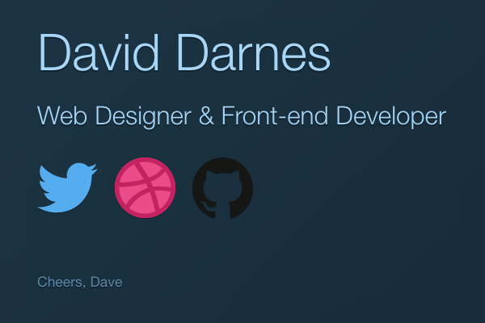
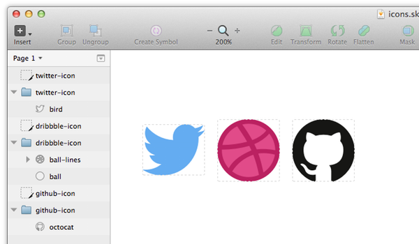

# 如何实现跨浏览器的SVG Sprites #

> 原文链接：[http://webdesign.tutsplus.com/tutorials/how-to-implement-cross-browser-svg-sprites--cms-22427](http://webdesign.tutsplus.com/tutorials/how-to-implement-cross-browser-svg-sprites--cms-22427)

In this tutorial I’m going to demonstrate a basic implementation of some SVG icons, how to provide a fallback, and how to turn them into an SVG sprite.

在这篇教程中我会演示一些SVG图标的基础实现、如何提供兼容，以及如何将它们转换成SVG sprite。

## 基础的SVG实现 ##

For the purpose of this tutorial I’m going to be using a single page, which will act as a kind of online business card. It will briefly introduce me and display three network profiles relevant to my work.

基于本文的目的，我会以一个像个人名片的东西来开始。它会简短地介绍一下我自己以及显示3个和我工作相关的网络档案。

From the screenshot above you can see that I’m using icons (for Twitter, Dribbble and GitHub) to symbolically reference my network profiles. I downloaded these icons from flaticon, which has a wide range of icons & symbols in both vector and raster formats. 

从上面的截图你可以看到我使用了三个图标（Twitter，Dribble 和 Github）象征着我的网络档案。这些图标我是从 [flaticon](http://www.flaticon.com/) 下载到的，这是一个具有各种不同图标和符号的网站，并且每个图标都提供矢量和光栅格式。

### PNG 和 SVG ###

We’re going to begin by using the PNG versions of these icons, for the sake of backward compatibility, then we’ll prepare the SVG versions to use in supporting browsers.

我们会在支持SVG的浏览器中使用SVG的格式，然后使用PNG格式的图标来实现向后兼容。

I used Sketch to output my PNG icons, so I’m going to use it again to prepare my icons for SVG usage.

我使用[Sketch](http://bohemiancoding.com/)来输出我的PNG图标，另外我还会再使用它来输出SVG格式的图标。

If you look at the screenshot above you’ll notice that I’ve named all my groups and shapes in the left hand panel appropriately (Adobe Illustrator has a similar view in the Layers panel). It’s important to name all your assets correctly, not only to help you remain organised but also for what we’ll be using them for later in this tutorial. 

在上面的截图中你会注意到我将分组和图形都在左侧面板进行了适当的命名。（Adobe Illustrator在图层面板中有个相似的视图）。将资源正确地命名是很重要的，不仅仅让它们保持组织性更加为了我们后面的使用。

### 输出SVG ###

Now I’ll export the icons as SVGs, which is straightforward with the slicing tool in Sketch. For more information on how this works take a look at Understanding Sketch’s Export Options. I’ll be exporting them as separate files and placing them into the images directory of my project.

现在我会将这些图标输出为SVG，我们可以用Sketch的裁剪工具来轻松地完成这项工作。在[Sketch的输出选项](http://webdesign.tutsplus.com/tutorials/understanding-sketchs-export-options--cms-22207)中你可以得到更多的信息从而明白它是怎么实现的。我会将它们输出为单独的文件并放置在我项目中的images目录中。

Normally, to show an image on your site you’d reference the asset with a src attributed element or something similar: 

通常地，你要在网站中展示一张图片你需要通过一个元素的src属性中来引入，类似下面这样：

    

However with SVGs there are a number of different ways we can use them within an HTML document. For example, we can use the actual SVG code inline - here’s what that code might look like:

然而，对于SVG来说我们可以有几种不同的方法来在HTML文档中使用它们。举个例子，我们可以使用直观的SVG代码来描述一张图片。代码可能会是这样：

	<?xml version="1.0" encoding="UTF-8" standalone="no"?>
	<svg width="50px" height="41px" viewBox="0 0 50 41" version="1.1" xmlns="http://www.w3.org/2000/svg" xmlns:xlink="http://www.w3.org/1999/xlink" xmlns:sketch="http://www.bohemiancoding.com/sketch/ns">
	    <!-- Generator: Sketch 3.1 (8751) - http://www.bohemiancoding.com/sketch -->
	    <title>twitter-icon</title>
	    <desc>Created with Sketch.</desc>
	    <defs></defs>
	    <g id="Page-1" stroke="none" stroke-width="1" fill="none" fill-rule="evenodd" sketch:type="MSPage">
	        <g id="twitter-icon" sketch:type="MSLayerGroup" fill="#55ACEE">
	            <path d="M0,36.3461306 C0.803663004,36.4417973 1.62142857,36.4907387 2.45054945,36.4907387 C7.26336996,36.4907387 11.6928571,34.8346712 15.2086081,32.0564595 C10.71337,31.9727973 6.91959707,28.9779505 5.61245421,24.8624369 C6.23956044,24.9834054 6.88315018,25.0482297 7.54505495,25.0482297 C8.48205128,25.0482297 9.38956044,24.9217207 10.2516484,24.684955 C5.55201465,23.7334595 2.01117216,19.5466577 2.01117216,14.5276667 C2.01117216,14.4840811 2.01117216,14.4406802 2.01190476,14.397464 C3.3970696,15.1733243 4.98095238,15.6392838 6.66501832,15.693027 C3.90860806,13.8354685 2.09487179,10.6648018 2.09487179,7.07102252 C2.09487179,5.17264865 2.6014652,3.39321171 3.48571429,1.86328378 C8.55238095,8.13037387 16.1217949,12.2543829 24.6595238,12.6863604 C24.4844322,11.9282297 24.3934066,11.1375946 24.3934066,10.3257207 C24.3934066,4.60511261 28.9930403,-0.0328738739 34.6664835,-0.0328738739 C37.6210623,-0.0328738739 40.2908425,1.2251982 42.1648352,3.23844595 C44.5047619,2.77377928 46.7032967,1.91167117 48.6880952,0.724702703 C47.9210623,3.14351802 46.2923077,5.17357207 44.1712454,6.45565315 C46.2492674,6.20522072 48.2291209,5.6483964 50.0714286,4.82451802 C48.6941392,6.90185135 46.952381,8.72635135 44.9454212,10.1868378 C44.9652015,10.6310045 44.9750916,11.0777568 44.9750916,11.5269099 C44.9750916,25.2155541 34.6424908,41 15.7472527,41 C9.9459707,41 4.54615385,39.2852027 0,36.3461306 L0,36.3461306 Z" id="bird" sketch:type="MSShapeGroup"></path>
	        </g>
	    </g>
	</svg>

This is one of the icons I exported, in XML format. This code is pretty much just like HTML (it’s a structural format) which means we can slot this straight into the page. 

这是我上面输出的其中一个图标，基于XML的格式的呈现。这些代码几乎就像一段HTML一样，这意味着我们可以插入这段代码到页面中。

### 在HTML中添加inline SVG ###

Let’s begin with the base HTML page which includes the PNG icons with their anchors, and a container:

让我们以一个基础的HTML页面开始，里面包含了3个赋予了链接的PNG图标，以及它们的容器：

	

	    
	    
	    
	

Now I’m going to copy and paste the SVG code, however I’m going to ignore the top line which refers to the file’s character encoding and other file attribute details. The HTML document contains that information already so we needn’t duplicate it.

现在我会开始复制上面SVG图标代码并黏贴到这里面，但我会忽略这段`<?xml version="1.0" encoding="UTF-8" standalone="no"?>`说明文件编码方式和其他信息的代码。因为在HTML文档中已经包含了这部分的信息，我们无需复制进去。

	

	    <a href="http://twitter.com/DavidDarnes" title="Twitter profile">
	    	<svg width="50px" height="41px" viewBox="0 0 50 41" version="1.1" xmlns="http://www.w3.org/2000/svg" xmlns:xlink="http://www.w3.org/1999/xlink" xmlns:sketch="http://www.bohemiancoding.com/sketch/ns">
		        <!-- Generator: Sketch 3.1 (8751) - http://www.bohemiancoding.com/sketch -->
		        <title>twitter-icon</title>
		        <desc>Created with Sketch.</desc>
		        <defs></defs>
		        <g id="Page-1" stroke="none" stroke-width="1" fill="none" fill-rule="evenodd" sketch:type="MSPage">
		            <g id="twitter-icon" sketch:type="MSLayerGroup" fill="#55ACEE">
		                <path d="M0,36.3461306 C0.803663004,36.4417973 1.62142857,36.4907387 2.45054945,36.4907387 C7.26336996,36.4907387 11.6928571,34.8346712 15.2086081,32.0564595 C10.71337,31.9727973 6.91959707,28.9779505 5.61245421,24.8624369 C6.23956044,24.9834054 6.88315018,25.0482297 7.54505495,25.0482297 C8.48205128,25.0482297 9.38956044,24.9217207 10.2516484,24.684955 C5.55201465,23.7334595 2.01117216,19.5466577 2.01117216,14.5276667 C2.01117216,14.4840811 2.01117216,14.4406802 2.01190476,14.397464 C3.3970696,15.1733243 4.98095238,15.6392838 6.66501832,15.693027 C3.90860806,13.8354685 2.09487179,10.6648018 2.09487179,7.07102252 C2.09487179,5.17264865 2.6014652,3.39321171 3.48571429,1.86328378 C8.55238095,8.13037387 16.1217949,12.2543829 24.6595238,12.6863604 C24.4844322,11.9282297 24.3934066,11.1375946 24.3934066,10.3257207 C24.3934066,4.60511261 28.9930403,-0.0328738739 34.6664835,-0.0328738739 C37.6210623,-0.0328738739 40.2908425,1.2251982 42.1648352,3.23844595 C44.5047619,2.77377928 46.7032967,1.91167117 48.6880952,0.724702703 C47.9210623,3.14351802 46.2923077,5.17357207 44.1712454,6.45565315 C46.2492674,6.20522072 48.2291209,5.6483964 50.0714286,4.82451802 C48.6941392,6.90185135 46.952381,8.72635135 44.9454212,10.1868378 C44.9652015,10.6310045 44.9750916,11.0777568 44.9750916,11.5269099 C44.9750916,25.2155541 34.6424908,41 15.7472527,41 C9.9459707,41 4.54615385,39.2852027 0,36.3461306 L0,36.3461306 Z" id="bird" sketch:type="MSShapeGroup"></path>
		            </g>
		        </g>
	        </svg>
	        
	    </a>
	    
	    
	

I’ve placed the SVG right above the corresponding PNG icon within the HTML page. For the time being I’m going to wrap the regular PNG image line in a comment tag to stop it appearing next to the SVG version. 

在这个HTML页面中，我已经将SVG放在了PNG图标的正上方。现在我要把PNG图片的代码注释掉防止它再SVG图片后面再出现一次。

### 清理 SVG ###

I’m also going to clean up the code within my SVG. Removing the element attributes is optional as most of the pieces I’m removing won’t change how the SVG will act. Here is a before and after if you wish to do the same with yours:

接着我准备清理一下上面的SVG代码。移除掉那些可选的元素属性因为我要移除的这些属性并不会影响SVG的表现。下面是优化后跟优化前的代码对比，但他们表现效果是一样的：

	<svg width="50px" height="41px" viewBox="0 0 50 41" version="1.1" xmlns="http://www.w3.org/2000/svg" xmlns:xlink="http://www.w3.org/1999/xlink" xmlns:sketch="http://www.bohemiancoding.com/sketch/ns">
	    <!-- Generator: Sketch 3.1 (8751) - http://www.bohemiancoding.com/sketch -->
	    <title>twitter-icon</title>
	    <desc>Created with Sketch.</desc>
	    <defs></defs>
	    <g id="Page-1" stroke="none" stroke-width="1" fill="none" fill-rule="evenodd" sketch:type="MSPage">
	        <g id="twitter-icon" sketch:type="MSLayerGroup" fill="#55ACEE">
	            <path d="M0,36.3461306 C0.803663004,36.4417973 1.62142857,36.4907387 2.45054945,36.4907387 C7.26336996,36.4907387 11.6928571,34.8346712 15.2086081,32.0564595 C10.71337,31.9727973 6.91959707,28.9779505 5.61245421,24.8624369 C6.23956044,24.9834054 6.88315018,25.0482297 7.54505495,25.0482297 C8.48205128,25.0482297 9.38956044,24.9217207 10.2516484,24.684955 C5.55201465,23.7334595 2.01117216,19.5466577 2.01117216,14.5276667 C2.01117216,14.4840811 2.01117216,14.4406802 2.01190476,14.397464 C3.3970696,15.1733243 4.98095238,15.6392838 6.66501832,15.693027 C3.90860806,13.8354685 2.09487179,10.6648018 2.09487179,7.07102252 C2.09487179,5.17264865 2.6014652,3.39321171 3.48571429,1.86328378 C8.55238095,8.13037387 16.1217949,12.2543829 24.6595238,12.6863604 C24.4844322,11.9282297 24.3934066,11.1375946 24.3934066,10.3257207 C24.3934066,4.60511261 28.9930403,-0.0328738739 34.6664835,-0.0328738739 C37.6210623,-0.0328738739 40.2908425,1.2251982 42.1648352,3.23844595 C44.5047619,2.77377928 46.7032967,1.91167117 48.6880952,0.724702703 C47.9210623,3.14351802 46.2923077,5.17357207 44.1712454,6.45565315 C46.2492674,6.20522072 48.2291209,5.6483964 50.0714286,4.82451802 C48.6941392,6.90185135 46.952381,8.72635135 44.9454212,10.1868378 C44.9652015,10.6310045 44.9750916,11.0777568 44.9750916,11.5269099 C44.9750916,25.2155541 34.6424908,41 15.7472527,41 C9.9459707,41 4.54615385,39.2852027 0,36.3461306 L0,36.3461306 Z" id="bird" sketch:type="MSShapeGroup"></path>
	        </g>
	    </g>
	</svg>

----------

	<svg width="50px" height="41px" viewBox="0 0 50 41" version="1.1" xmlns="http://www.w3.org/2000/svg">
	    <g id="twitter-icon" fill="#55ACEE">
	        <path d="M0,36.3461306 C0.803663004,36.4417973 1.62142857,36.4907387 2.45054945,36.4907387 C7.26336996,36.4907387 11.6928571,34.8346712 15.2086081,32.0564595 C10.71337,31.9727973 6.91959707,28.9779505 5.61245421,24.8624369 C6.23956044,24.9834054 6.88315018,25.0482297 7.54505495,25.0482297 C8.48205128,25.0482297 9.38956044,24.9217207 10.2516484,24.684955 C5.55201465,23.7334595 2.01117216,19.5466577 2.01117216,14.5276667 C2.01117216,14.4840811 2.01117216,14.4406802 2.01190476,14.397464 C3.3970696,15.1733243 4.98095238,15.6392838 6.66501832,15.693027 C3.90860806,13.8354685 2.09487179,10.6648018 2.09487179,7.07102252 C2.09487179,5.17264865 2.6014652,3.39321171 3.48571429,1.86328378 C8.55238095,8.13037387 16.1217949,12.2543829 24.6595238,12.6863604 C24.4844322,11.9282297 24.3934066,11.1375946 24.3934066,10.3257207 C24.3934066,4.60511261 28.9930403,-0.0328738739 34.6664835,-0.0328738739 C37.6210623,-0.0328738739 40.2908425,1.2251982 42.1648352,3.23844595 C44.5047619,2.77377928 46.7032967,1.91167117 48.6880952,0.724702703 C47.9210623,3.14351802 46.2923077,5.17357207 44.1712454,6.45565315 C46.2492674,6.20522072 48.2291209,5.6483964 50.0714286,4.82451802 C48.6941392,6.90185135 46.952381,8.72635135 44.9454212,10.1868378 C44.9652015,10.6310045 44.9750916,11.0777568 44.9750916,11.5269099 C44.9750916,25.2155541 34.6424908,41 15.7472527,41 C9.9459707,41 4.54615385,39.2852027 0,36.3461306 L0,36.3461306 Z" id="bird"></path>
	    </g>
	</svg>

Take note of the elements I’ve removed. The `<title>`, `<desc>`, and `<defs>` elements aren’t needed now, but we may need them later on in this tutorial. There are also a few <g> elements which refer to groups, and correspond to the groups created in my Sketch document. By default Sketch places everything inside a page, hence the group element <g id=”Page-1”… . You can remove this as it doesn’t have a use for us (the group within it is more important). Sketch does provide an option to produce cleaner SVGs upon exporting, however there is no harm in cleaning the code up yourself.

注意我移除的那些元素。 `<title>`, `<desc>`, 和 `<defs>`元素目前是不需要的，但在本文后面我们可能会用到它们。其中代表着分组的`<g>`元素相当于我在Sketch文档中的分组。默认地Sketch是将所有的东西放在一个页面中的，相当于组元素`<g id=”Page-1”…`。你可以把这个元素移除掉因为它对我们来说没有什么作用（在它里面的组元素才是重要的）。Sketch提供了一个选项让我们在输出之前处理SVG的清理工作，但你自己来清理一遍也没多大问题。

The final part of this step is to remove the height and width attributes within the SVG element itself. These will need to be compensated for in my CSS file, as shown below:

这部分的最后一步就是移除掉SVG标签上的`height`和`width`属性。它们会在我的CSS文件中来定义，如下所示：

	<svg viewBox="0 0 50 41" version="1.1" xmlns="http://www.w3.org/2000/svg">
	    <g id="twitter-icon" fill="#55ACEE">
	        <path d="M0,36.3461306 C0.803663004,36.4417973 1.62142857,36.4907387 2.45054945,36.4907387 C7.26336996,36.4907387 11.6928571,34.8346712 15.2086081,32.0564595 C10.71337,31.9727973 6.91959707,28.9779505 5.61245421,24.8624369 C6.23956044,24.9834054 6.88315018,25.0482297 7.54505495,25.0482297 C8.48205128,25.0482297 9.38956044,24.9217207 10.2516484,24.684955 C5.55201465,23.7334595 2.01117216,19.5466577 2.01117216,14.5276667 C2.01117216,14.4840811 2.01117216,14.4406802 2.01190476,14.397464 C3.3970696,15.1733243 4.98095238,15.6392838 6.66501832,15.693027 C3.90860806,13.8354685 2.09487179,10.6648018 2.09487179,7.07102252 C2.09487179,5.17264865 2.6014652,3.39321171 3.48571429,1.86328378 C8.55238095,8.13037387 16.1217949,12.2543829 24.6595238,12.6863604 C24.4844322,11.9282297 24.3934066,11.1375946 24.3934066,10.3257207 C24.3934066,4.60511261 28.9930403,-0.0328738739 34.6664835,-0.0328738739 C37.6210623,-0.0328738739 40.2908425,1.2251982 42.1648352,3.23844595 C44.5047619,2.77377928 46.7032967,1.91167117 48.6880952,0.724702703 C47.9210623,3.14351802 46.2923077,5.17357207 44.1712454,6.45565315 C46.2492674,6.20522072 48.2291209,5.6483964 50.0714286,4.82451802 C48.6941392,6.90185135 46.952381,8.72635135 44.9454212,10.1868378 C44.9652015,10.6310045 44.9750916,11.0777568 44.9750916,11.5269099 C44.9750916,25.2155541 34.6424908,41 15.7472527,41 C9.9459707,41 4.54615385,39.2852027 0,36.3461306 L0,36.3461306 Z" id="bird"></path>
	    </g>
	</svg>

----------
	.icon {
	    max-width: 40px;
	    max-height: 40px;
	    transition: .2s;
	    -webkit-filter: drop-shadow(0 1px 0 #11222d);
	}

If you’ve followed my steps you should be able to see in the browser a sharp and clean vector version of your graphics. 

如果你跟着我的步骤你应该能在浏览器看到一个简洁锐利的矢量图。

Tip: Check if the graphic is actually an SVG by zooming in Command-+ when viewing it in the browser. The graphic should stay sharp no matter how far you zoom in.

提示：你可以通过浏览器的放大缩小来看看这个图片是否为SVG。这个图片不应该会受到你浏览器放大缩小而产生变化。

## 提供Fallback

If you’re using this for client work you may be wondering what the browser support is like. Inline SVGs work in all browsers except for Internet Explorer 8 (and earlier) and Opera Mini. Can I Use currently says that IE8 is used around 4% globally and Opera Mini around 3%. So in your case you might not need to provide a fallback, however I’m going to demonstrate a solution.

如果你使用svg来在客户端显示，你会想它的浏览器支持程度如何，实际上svg可以在除了ie8（和ie8以下的）以及 Opera Mini 以外的所有浏览器上工作。但就目前来说，ie8在全球中只占到了4%的份额，Opera Mini 只有3%的份额。所以你没必要去为他们提供兼容，但尽管如此我还是会给给你一个解决方案。

	<a href="http://twitter.com/DavidDarnes" title="twitter profile">
	   <svg viewBox="0 0 50 41" version="1.1" xmlns="http://www.w3.org/2000/svg">
	       <g id="twitter-icon" fill="#55ACEE">
	           <path d="M0,36.3461306 C0.803663004,36.4417973 1.62142857,36.4907387 2.45054945,36.4907387 C7.26336996,36.4907387 11.6928571,34.8346712 15.2086081,32.0564595 C10.71337,31.9727973 6.91959707,28.9779505 5.61245421,24.8624369 C6.23956044,24.9834054 6.88315018,25.0482297 7.54505495,25.0482297 C8.48205128,25.0482297 9.38956044,24.9217207 10.2516484,24.684955 C5.55201465,23.7334595 2.01117216,19.5466577 2.01117216,14.5276667 C2.01117216,14.4840811 2.01117216,14.4406802 2.01190476,14.397464 C3.3970696,15.1733243 4.98095238,15.6392838 6.66501832,15.693027 C3.90860806,13.8354685 2.09487179,10.6648018 2.09487179,7.07102252 C2.09487179,5.17264865 2.6014652,3.39321171 3.48571429,1.86328378 C8.55238095,8.13037387 16.1217949,12.2543829 24.6595238,12.6863604 C24.4844322,11.9282297 24.3934066,11.1375946 24.3934066,10.3257207 C24.3934066,4.60511261 28.9930403,-0.0328738739 34.6664835,-0.0328738739 C37.6210623,-0.0328738739 40.2908425,1.2251982 42.1648352,3.23844595 C44.5047619,2.77377928 46.7032967,1.91167117 48.6880952,0.724702703 C47.9210623,3.14351802 46.2923077,5.17357207 44.1712454,6.45565315 C46.2492674,6.20522072 48.2291209,5.6483964 50.0714286,4.82451802 C48.6941392,6.90185135 46.952381,8.72635135 44.9454212,10.1868378 C44.9652015,10.6310045 44.9750916,11.0777568 44.9750916,11.5269099 C44.9750916,25.2155541 34.6424908,41 15.7472527,41 C9.9459707,41 4.54615385,39.2852027 0,36.3461306 L0,36.3461306 Z" id="bird"></path>
	       </g>
	   </svg>
	   <!--  -->
	</a>

Here is one of my SVG icons within the page, and you’ll notice that my original PNG icon is still in place but wrapped in comments. This PNG image will be our fallback. 

这是我上面3个图标中的其中一个图标，但你会注意到我的png图标也在里面，只是以注释地形式存在着。这个png图片就是我们的fallback。

### 干掉注释

First I’ll remove the comments. We now need to move the `` up and into the `<svg>` element itself, right after the group containing our actual icon.

首先我会移除掉上面的注释。我需要将``移动到`<svg>`元素里面，放在组元素`<g>`后面。

Next, I’m going to wrap the `` in an SVG-specific element called `foreignObject`. If the browser cannot understand the SVG’s vector information then it will refer to the “foreign object” instead and will proceed to use the `` within it. We also need to let the browser know that it should opt for the vector version if it supports it. This is what the `<switch>` element is for, which is what I’ve wrapped both the group and the foreignObject in. 

然后我会将``包裹在svg特有的元素`foreignObject`里面。如果浏览器不能识别svg的矢量信息，它会找到“foreign object”并使用它里面的``元素。我们也需要告诉浏览器如果支持矢量图标那就应该把“foreign object”忽略掉。这就是`<switch>`元素存在的目的了，我用它来将`<g>`元素和`<foreignObject>`元素包裹了起来。

下面是更新后的代码：

	<a href="http://twitter.com/DavidDarnes" title="twitter profile">
	   <svg viewBox="0 0 50 41" version="1.1" xmlns="http://www.w3.org/2000/svg">
	       <switch>
	           <g id="twitter-icon" fill="#55ACEE">
	               <path d="M0,36.3461306 C0.803663004,36.4417973 1.62142857,36.4907387 2.45054945,36.4907387 C7.26336996,36.4907387 11.6928571,34.8346712 15.2086081,32.0564595 C10.71337,31.9727973 6.91959707,28.9779505 5.61245421,24.8624369 C6.23956044,24.9834054 6.88315018,25.0482297 7.54505495,25.0482297 C8.48205128,25.0482297 9.38956044,24.9217207 10.2516484,24.684955 C5.55201465,23.7334595 2.01117216,19.5466577 2.01117216,14.5276667 C2.01117216,14.4840811 2.01117216,14.4406802 2.01190476,14.397464 C3.3970696,15.1733243 4.98095238,15.6392838 6.66501832,15.693027 C3.90860806,13.8354685 2.09487179,10.6648018 2.09487179,7.07102252 C2.09487179,5.17264865 2.6014652,3.39321171 3.48571429,1.86328378 C8.55238095,8.13037387 16.1217949,12.2543829 24.6595238,12.6863604 C24.4844322,11.9282297 24.3934066,11.1375946 24.3934066,10.3257207 C24.3934066,4.60511261 28.9930403,-0.0328738739 34.6664835,-0.0328738739 C37.6210623,-0.0328738739 40.2908425,1.2251982 42.1648352,3.23844595 C44.5047619,2.77377928 46.7032967,1.91167117 48.6880952,0.724702703 C47.9210623,3.14351802 46.2923077,5.17357207 44.1712454,6.45565315 C46.2492674,6.20522072 48.2291209,5.6483964 50.0714286,4.82451802 C48.6941392,6.90185135 46.952381,8.72635135 44.9454212,10.1868378 C44.9652015,10.6310045 44.9750916,11.0777568 44.9750916,11.5269099 C44.9750916,25.2155541 34.6424908,41 15.7472527,41 C9.9459707,41 4.54615385,39.2852027 0,36.3461306 L0,36.3461306 Z" id="bird"></path>
	           </g>
	           <foreignObject>
	               
	           </foreignObject>
	       </switch>
	   </svg>
	</a>
	
If you’ve followed this process and structured your HTML like mine then your graphic should fallback to your original raster image if the browser doesn’t support SVG.

如果你跟着我的步伐到这里并写下我上面这段html，你会发现如果你的浏览器不支持svg它就会使用png图片来显示。

## 创建一个 SVG Sprite

SVG sprites act pretty much just like image sprites. In their simplest form sprites are a collection of graphical elements combined into one image. Each image is then picked out using CSS and HTML, normally by specifying coordinates and a viewing “window”. 

svg sprites几乎跟image sprites一样。就最简单的形式来说，sprites是将几张图合并到一起的一张图片。每一张图都可以通过css和html来获取，一般通过一个指定的坐标和一个观察“窗口”来确定每张图片的位置。

The two main benefits to this are an improved page load time, better workflow, and consistency between the graphical elements on the page. The second and third points apply very well to SVG sprites. Instead of several blocks of SVG code littered throughout our page, we would only have one place to update our SVGs.

它最主要的优点就是能减少页面的加载时间，更好的开发流程，以及页面中图片元素的一致性。其中第二和第三点可以很好地应用在svg sprites中。因为我们可以紧紧在一处地方更新我们的svg而不是让svg的代码块散落在文档的各个地方。

To start with I will make a new `<svg>` element within the `<head>` element of my page, just before the closing tag. This new SVG will hold all the icons I previously had within the page.

我会在页面的`<head>`元素的闭合标签`</head>`前面创建一个新的`<svg>`元素。这个`<svg>`元素将会包含我前面所有的图标。

Next I need to move my icons into it. I don’t need to move the whole SVG, just the group element and its contents. These I can stack within the `<svg>` element in the head. 

下一步我要将图标都放到里面去。但我不需要把整个svg代码块都放进去，只要把组元素`<g>`和它的内容堆叠到头部的`<svg>`元素里就好了。

	<!doctype html>
	<html lang="en">
	  <head>
	      <meta charset="utf-8" />
	      <title>David Darnes - Web Designer &amp; Front-end Developer</title>
	      <link rel="stylesheet" type="text/css" href="style.css" />
	      <!--[if IE]>
	          
	      <![endif]-->
	      <svg display="none" version="1.1" xmlns="http://www.w3.org/2000/svg">
	          <g id="twitter-icon" fill="#55ACEE">
	              <path d="M0,36.3461306 C0.803663004,36.4417973 1.62142857,36.4907387 2.45054945,36.4907387 C7.26336996,36.4907387 11.6928571,34.8346712 15.2086081,32.0564595 C10.71337,31.9727973 6.91959707,28.9779505 5.61245421,24.8624369 C6.23956044,24.9834054 6.88315018,25.0482297 7.54505495,25.0482297 C8.48205128,25.0482297 9.38956044,24.9217207 10.2516484,24.684955 C5.55201465,23.7334595 2.01117216,19.5466577 2.01117216,14.5276667 C2.01117216,14.4840811 2.01117216,14.4406802 2.01190476,14.397464 C3.3970696,15.1733243 4.98095238,15.6392838 6.66501832,15.693027 C3.90860806,13.8354685 2.09487179,10.6648018 2.09487179,7.07102252 C2.09487179,5.17264865 2.6014652,3.39321171 3.48571429,1.86328378 C8.55238095,8.13037387 16.1217949,12.2543829 24.6595238,12.6863604 C24.4844322,11.9282297 24.3934066,11.1375946 24.3934066,10.3257207 C24.3934066,4.60511261 28.9930403,-0.0328738739 34.6664835,-0.0328738739 C37.6210623,-0.0328738739 40.2908425,1.2251982 42.1648352,3.23844595 C44.5047619,2.77377928 46.7032967,1.91167117 48.6880952,0.724702703 C47.9210623,3.14351802 46.2923077,5.17357207 44.1712454,6.45565315 C46.2492674,6.20522072 48.2291209,5.6483964 50.0714286,4.82451802 C48.6941392,6.90185135 46.952381,8.72635135 44.9454212,10.1868378 C44.9652015,10.6310045 44.9750916,11.0777568 44.9750916,11.5269099 C44.9750916,25.2155541 34.6424908,41 15.7472527,41 C9.9459707,41 4.54615385,39.2852027 0,36.3461306 L0,36.3461306 Z" id="bird"></path>
	          </g>
	          <g id="dribbble-icon">
	              <path d="M25.0002551,0 C11.1927551,0 0.000255102041,11.1925 0.000255102041,25 C0.000255102041,38.8075 11.1927551,50 25.0002551,50 C38.8077551,50 50.0002551,38.8075 50.0002551,25 C50.0002551,11.1925 38.8077551,0 25.0002551,0 L25.0002551,0 L25.0002551,0 Z" id="ball" fill="#EA4C89"></path>
	              <path d="M25.0002551,-0.000510204082 C11.1927551,-0.000510204082 0.000255102041,11.1919898 0.000255102041,24.9994898 C0.000255102041,38.8069898 11.1927551,49.9994898 25.0002551,49.9994898 C38.8077551,49.9994898 50.0002551,38.8069898 50.0002551,24.9994898 C50.0002551,11.1919898 38.8077551,-0.000510204082 25.0002551,-0.000510204082 L25.0002551,-0.000510204082 L25.0002551,-0.000510204082 Z M25.0002551,3.6219898 C30.4465051,3.6219898 35.4177551,5.6594898 39.1927551,9.0119898 C36.4190051,12.6707398 32.2052551,15.1069898 27.9827551,16.7557398 C25.6815051,12.5457398 22.8477551,8.1069898 19.9640051,4.2182398 C21.5777551,3.8282398 23.2640051,3.6219898 25.0002551,3.6219898 L25.0002551,3.6219898 L25.0002551,3.6219898 Z M15.9052551,5.6482398 C18.6915051,9.8169898 21.3915051,13.6832398 23.8590051,18.0594898 C17.6202551,19.6757398 10.5727551,20.6457398 4.0615051,20.6619898 C5.4340051,14.0019898 9.9077551,8.4719898 15.9052551,5.6482398 L15.9052551,5.6482398 L15.9052551,5.6482398 Z M41.5640051,11.4844898 C44.5465051,15.1332398 46.3427551,19.7869898 46.3777551,24.8582398 C41.4327551,23.8844898 36.5140051,23.6282398 31.5077551,24.1332398 C30.9440051,22.7294898 30.2627551,21.3969898 29.6090051,19.9582398 C33.9252551,18.2169898 38.5402551,15.2369898 41.5640051,11.4844898 L41.5640051,11.4844898 L41.5640051,11.4844898 Z M25.5952551,21.3669898 C26.1302551,22.5057398 26.7502551,23.7119898 27.3315051,24.9457398 C20.3690051,28.0157398 12.9640051,32.1182398 9.1190051,39.3107398 C5.7027551,35.5219898 3.6227551,30.5019898 3.6227551,24.9994898 C3.6227551,24.7907398 3.6265051,24.5819898 3.6327551,24.3744898 C11.0890051,24.3382398 18.4077551,23.4057398 25.5952551,21.3669898 L25.5952551,21.3669898 L25.5952551,21.3669898 Z M36.8915051,27.1957398 C39.9990051,27.1857398 43.2102551,27.6194898 46.1115051,28.3832398 C45.1627551,34.3532398 41.7402551,39.5019898 36.9277551,42.7419898 C35.7802551,37.5232398 34.6865051,32.5294898 32.7527551,27.4944898 C34.0865051,27.2957398 35.4790051,27.1994898 36.8915051,27.1957398 L36.8915051,27.1957398 L36.8915051,27.1957398 Z M28.7965051,28.4719898 C30.7677551,33.5619898 32.3140051,39.1994898 33.3515051,44.6857398 C30.7852551,45.7757398 27.9640051,46.3782398 25.0002551,46.3782398 C20.0565051,46.3782398 15.5040051,44.6982398 11.8827551,41.8794898 C15.7540051,35.5982398 21.7502551,30.8457398 28.7965051,28.4719898 L28.7965051,28.4719898 L28.7965051,28.4719898 Z" id="ball-lines" fill="#C32361"></path>
	          </g>
	          <g id="github-icon" fill="#161614">
	              <path d="M0,25.633467 C0,36.9584555 7.1625894,46.5651047 17.0969029,49.954576 C18.3477086,50.1906116 18.8035237,49.3991056 18.8035237,48.719323 C18.8035237,48.1119247 18.7820375,46.4990147 18.7697597,44.3605321 C11.8158937,45.9089257 10.3486909,40.9238537 10.3486909,40.9238537 C9.21145523,37.9623936 7.57236256,37.1740347 7.57236256,37.1740347 C5.30249547,35.5847282 7.74425243,35.6161996 7.74425243,35.6161996 C10.2535376,35.7971603 11.5734062,38.2582249 11.5734062,38.2582249 C13.8033703,42.1748424 17.4253353,41.0434451 18.8495657,40.3872661 C19.0767059,38.7318697 19.7228276,37.6020459 20.4364775,36.9616026 C14.8853556,36.314865 9.04877375,34.1150132 9.04877375,24.2927848 C9.04877375,21.494976 10.0233279,19.2054306 11.6225176,17.4147071 C11.3646828,16.766396 10.5067682,14.1589893 11.8680745,10.6310438 C11.8680745,10.6310438 13.9660518,9.9418198 18.7421345,13.2589069 C20.73575,12.6892743 22.875165,12.4060315 25.0007674,12.3950166 C27.124835,12.4060315 29.2627152,12.6892743 31.2594002,13.2589069 C36.0324135,9.9418198 38.1273213,10.6310438 38.1273213,10.6310438 C39.4916971,14.1589893 38.6337825,16.766396 38.3774824,17.4147071 C39.9797416,19.2054306 40.9466221,21.494976 40.9466221,24.2927848 C40.9466221,34.1401903 35.1008318,36.3069972 29.5328279,36.9411462 C30.4291108,37.7326523 31.2287056,39.2967816 31.2287056,41.688609 C31.2287056,45.1142725 31.198011,47.8790363 31.198011,48.719323 C31.198011,49.4053999 31.6492219,50.2032002 32.9169097,49.9530025 C42.8435495,46.5556633 50,36.9553083 50,25.633467 C50,11.4760513 38.8056724,0 24.9976979,0 C11.1943276,0 0,11.4760513 0,25.633467 Z" id="octocat"></path>
	          </g>
	      </svg>
	  </head>
	  
Note: If you're comfortable using Grunt, there’s a plugin will automate the combining of all your separate SVG files.

提示：如果你熟悉Grunt的使用，你可以用一个插件来自动的将你所有单独的svg文件合并到一起。

### 隐藏!

Now we have all our icons in the head we need to hide them; adding an attribute of display=”none” to the new `<svg>` will mean all the icons won’t appear at the top of the page.

现在我们把所有的图标都放在头部，我们需要把它们隐藏起来。`<svg>`在这个标签中添加一个属性`display=”none”`就能让所有的图标都不显示在页面的头部了。

### 定义每一个图标

Our next step is to define each icon so we can reuse them in the page, which is where the defs element we deleted earlier comes back into play. By using it to wrap all the groups, thus wrapping all my icons, I can state that I want to reuse these elsewhere on  the page.

我们下一步就是去定义每一个图标这样我门才能在页面中重用他们，定义的地方就在我们之前清理svg时删掉的`<defs>`元素里面，通过用它来包裹所有的组元素`<g>`，就能把所有的图标都放进去，然后在页面任何地方使用了。

	<!doctype html>
	<html lang="en">
	    <head>
	        <meta charset="utf-8" />
	        <title>David Darnes - Web Designer &amp; Front-end Developer</title>
	        <link rel="stylesheet" type="text/css" href="style.css" />
	        <!--[if IE]>
	            
	        <![endif]-->
	        <svg display="none" version="1.1" xmlns="http://www.w3.org/2000/svg">
	            <defs>
	                <g id="twitter-icon" fill="#55ACEE">
	                    <path d="M0,36.3461306 C0.803663004,36.4417973 1.62142857,36.4907387 2.45054945,36.4907387 C7.26336996,36.4907387 11.6928571,34.8346712 15.2086081,32.0564595 C10.71337,31.9727973 6.91959707,28.9779505 5.61245421,24.8624369 C6.23956044,24.9834054 6.88315018,25.0482297 7.54505495,25.0482297 C8.48205128,25.0482297 9.38956044,24.9217207 10.2516484,24.684955 C5.55201465,23.7334595 2.01117216,19.5466577 2.01117216,14.5276667 C2.01117216,14.4840811 2.01117216,14.4406802 2.01190476,14.397464 C3.3970696,15.1733243 4.98095238,15.6392838 6.66501832,15.693027 C3.90860806,13.8354685 2.09487179,10.6648018 2.09487179,7.07102252 C2.09487179,5.17264865 2.6014652,3.39321171 3.48571429,1.86328378 C8.55238095,8.13037387 16.1217949,12.2543829 24.6595238,12.6863604 C24.4844322,11.9282297 24.3934066,11.1375946 24.3934066,10.3257207 C24.3934066,4.60511261 28.9930403,-0.0328738739 34.6664835,-0.0328738739 C37.6210623,-0.0328738739 40.2908425,1.2251982 42.1648352,3.23844595 C44.5047619,2.77377928 46.7032967,1.91167117 48.6880952,0.724702703 C47.9210623,3.14351802 46.2923077,5.17357207 44.1712454,6.45565315 C46.2492674,6.20522072 48.2291209,5.6483964 50.0714286,4.82451802 C48.6941392,6.90185135 46.952381,8.72635135 44.9454212,10.1868378 C44.9652015,10.6310045 44.9750916,11.0777568 44.9750916,11.5269099 C44.9750916,25.2155541 34.6424908,41 15.7472527,41 C9.9459707,41 4.54615385,39.2852027 0,36.3461306 L0,36.3461306 Z" id="bird"></path>
	                </g>
	                <g id="dribbble-icon">
	                    <path d="M25.0002551,0 C11.1927551,0 0.000255102041,11.1925 0.000255102041,25 C0.000255102041,38.8075 11.1927551,50 25.0002551,50 C38.8077551,50 50.0002551,38.8075 50.0002551,25 C50.0002551,11.1925 38.8077551,0 25.0002551,0 L25.0002551,0 L25.0002551,0 Z" id="ball" fill="#EA4C89"></path>
	                    <path d="M25.0002551,-0.000510204082 C11.1927551,-0.000510204082 0.000255102041,11.1919898 0.000255102041,24.9994898 C0.000255102041,38.8069898 11.1927551,49.9994898 25.0002551,49.9994898 C38.8077551,49.9994898 50.0002551,38.8069898 50.0002551,24.9994898 C50.0002551,11.1919898 38.8077551,-0.000510204082 25.0002551,-0.000510204082 L25.0002551,-0.000510204082 L25.0002551,-0.000510204082 Z M25.0002551,3.6219898 C30.4465051,3.6219898 35.4177551,5.6594898 39.1927551,9.0119898 C36.4190051,12.6707398 32.2052551,15.1069898 27.9827551,16.7557398 C25.6815051,12.5457398 22.8477551,8.1069898 19.9640051,4.2182398 C21.5777551,3.8282398 23.2640051,3.6219898 25.0002551,3.6219898 L25.0002551,3.6219898 L25.0002551,3.6219898 Z M15.9052551,5.6482398 C18.6915051,9.8169898 21.3915051,13.6832398 23.8590051,18.0594898 C17.6202551,19.6757398 10.5727551,20.6457398 4.0615051,20.6619898 C5.4340051,14.0019898 9.9077551,8.4719898 15.9052551,5.6482398 L15.9052551,5.6482398 L15.9052551,5.6482398 Z M41.5640051,11.4844898 C44.5465051,15.1332398 46.3427551,19.7869898 46.3777551,24.8582398 C41.4327551,23.8844898 36.5140051,23.6282398 31.5077551,24.1332398 C30.9440051,22.7294898 30.2627551,21.3969898 29.6090051,19.9582398 C33.9252551,18.2169898 38.5402551,15.2369898 41.5640051,11.4844898 L41.5640051,11.4844898 L41.5640051,11.4844898 Z M25.5952551,21.3669898 C26.1302551,22.5057398 26.7502551,23.7119898 27.3315051,24.9457398 C20.3690051,28.0157398 12.9640051,32.1182398 9.1190051,39.3107398 C5.7027551,35.5219898 3.6227551,30.5019898 3.6227551,24.9994898 C3.6227551,24.7907398 3.6265051,24.5819898 3.6327551,24.3744898 C11.0890051,24.3382398 18.4077551,23.4057398 25.5952551,21.3669898 L25.5952551,21.3669898 L25.5952551,21.3669898 Z M36.8915051,27.1957398 C39.9990051,27.1857398 43.2102551,27.6194898 46.1115051,28.3832398 C45.1627551,34.3532398 41.7402551,39.5019898 36.9277551,42.7419898 C35.7802551,37.5232398 34.6865051,32.5294898 32.7527551,27.4944898 C34.0865051,27.2957398 35.4790051,27.1994898 36.8915051,27.1957398 L36.8915051,27.1957398 L36.8915051,27.1957398 Z M28.7965051,28.4719898 C30.7677551,33.5619898 32.3140051,39.1994898 33.3515051,44.6857398 C30.7852551,45.7757398 27.9640051,46.3782398 25.0002551,46.3782398 C20.0565051,46.3782398 15.5040051,44.6982398 11.8827551,41.8794898 C15.7540051,35.5982398 21.7502551,30.8457398 28.7965051,28.4719898 L28.7965051,28.4719898 L28.7965051,28.4719898 Z" id="ball-lines" fill="#C32361"></path>
	                </g>
	                <g id="github-icon" fill="#161614">
	                    <path d="M0,25.633467 C0,36.9584555 7.1625894,46.5651047 17.0969029,49.954576 C18.3477086,50.1906116 18.8035237,49.3991056 18.8035237,48.719323 C18.8035237,48.1119247 18.7820375,46.4990147 18.7697597,44.3605321 C11.8158937,45.9089257 10.3486909,40.9238537 10.3486909,40.9238537 C9.21145523,37.9623936 7.57236256,37.1740347 7.57236256,37.1740347 C5.30249547,35.5847282 7.74425243,35.6161996 7.74425243,35.6161996 C10.2535376,35.7971603 11.5734062,38.2582249 11.5734062,38.2582249 C13.8033703,42.1748424 17.4253353,41.0434451 18.8495657,40.3872661 C19.0767059,38.7318697 19.7228276,37.6020459 20.4364775,36.9616026 C14.8853556,36.314865 9.04877375,34.1150132 9.04877375,24.2927848 C9.04877375,21.494976 10.0233279,19.2054306 11.6225176,17.4147071 C11.3646828,16.766396 10.5067682,14.1589893 11.8680745,10.6310438 C11.8680745,10.6310438 13.9660518,9.9418198 18.7421345,13.2589069 C20.73575,12.6892743 22.875165,12.4060315 25.0007674,12.3950166 C27.124835,12.4060315 29.2627152,12.6892743 31.2594002,13.2589069 C36.0324135,9.9418198 38.1273213,10.6310438 38.1273213,10.6310438 C39.4916971,14.1589893 38.6337825,16.766396 38.3774824,17.4147071 C39.9797416,19.2054306 40.9466221,21.494976 40.9466221,24.2927848 C40.9466221,34.1401903 35.1008318,36.3069972 29.5328279,36.9411462 C30.4291108,37.7326523 31.2287056,39.2967816 31.2287056,41.688609 C31.2287056,45.1142725 31.198011,47.8790363 31.198011,48.719323 C31.198011,49.4053999 31.6492219,50.2032002 32.9169097,49.9530025 C42.8435495,46.5556633 50,36.9553083 50,25.633467 C50,11.4760513 38.8056724,0 24.9976979,0 C11.1943276,0 0,11.4760513 0,25.633467 Z" id="octocat"></path>
	                </g>
	            </defs>
	        </svg>
	    </head>

### 使用图标

The icons are now defined but we need a method of using them, which is what the use element is for. The `<use>` element allows us to take any element within the `<defs>` element and pull it through to anywhere on our page. The way we pick the element is by using its ID, which is why is was important to name our icons in the initial Sketch document. 

图标我们已经定义好了，但需要一个方法来引用，`use` 元素就是用来干这个事情的。`<use>`元素允许我们把`<defs>`元素里面的任意元素取出放到页面的任何地方。我们是通过它的id的来取到它们的，这也是为什么在Sketch文档中命名我们的图标是件很重要的事情。

Take note of the IDs in the example above and then see how I’m referencing each one with the use element like so <use xlink:href="#twitter-icon"></use>.

注意前面例子中元素的id，然后我是这样通过`use`元素来映射它们的，`<use xlink:href="#twitter-icon"></use>`。

	

	   <a href="http://twitter.com/DavidDarnes" title="Twitter profile">
	       <svg class="icon" viewBox="0 0 50 41">
	           <switch>
	               <use xlink:href="#twitter-icon"></use>
	               <foreignObject>
	                   
	               </foreignObject>
	           </switch>
	       </svg>
	   </a>
	   <a href="http://dribbble.com/DavidDarnes" title="Dribbble profile">
	       <svg class="icon" viewBox="0 0 50 50">
	           <switch>
	               <use xlink:href="#dribbble-icon"></use>
	               <foreignObject>
	                   
	               </foreignObject>
	           </switch>
	       </svg>
	   </a>
	   <a href="http://github.com/DavidDarnes" title="GitHub profile">
	       <svg class="icon" viewBox="0 0 50 50">
	           <switch>
	               <use xlink:href="#github-icon"></use>
	               <foreignObject>
	                   
	               </foreignObject>
	           </switch>
	       </svg>
	   </a>
	

If you’ve followed the steps correctly you won’t see any change to how your graphics appear, however you can now reuse them (at whatever size you wish) and apply each one multiple times on the page.

跟着我的教程到这里，你会发现你的图片没有任何变化，但是你现在可以在任意的位置不限次数地（以任何尺寸）来使用它们。

## 让你的SVG Sprite更加完美

One plus point to using SVG sprites is that your visible page code is much cleaner and can be read more easily by other people working with your code. We can improve on this even more. 

一个使用svg sprites的优点是你页面上的代码变地更加地简洁并且对于你的合作伙伴来说它的可读性也更加强了。但我们还可以进一步地优化。

Below I’ve changed the `<g>` elements in my SVG sprite to the symbol element, plus I’ve moved the viewbox attribute from the SVG elements in the page to the new symbol elements.

下面我把在svg sprite中的`<g>`元素替换为`<symbol>`元素，另外我把`viewbox`属性从svg元素移动到`<symbol>`元素上。

	<!doctype html>
	<html lang="en">
	    <head>
	        <meta charset="utf-8" />
	        <title>David Darnes - Web Designer &amp; Front-end Developer</title>
	        <link rel="stylesheet" type="text/css" href="style.css" />
	        <!--[if IE]>
	            
	        <![endif]-->
	        <svg display="none" version="1.1" xmlns="http://www.w3.org/2000/svg">
	            <defs>
	                <symbol id="twitter-icon" viewBox="0 0 50 41" fill="#55ACEE">
	                    <path d="M0,36.3461306 C0.803663004,36.4417973 1.62142857,36.4907387 2.45054945,36.4907387 C7.26336996,36.4907387 11.6928571,34.8346712 15.2086081,32.0564595 C10.71337,31.9727973 6.91959707,28.9779505 5.61245421,24.8624369 C6.23956044,24.9834054 6.88315018,25.0482297 7.54505495,25.0482297 C8.48205128,25.0482297 9.38956044,24.9217207 10.2516484,24.684955 C5.55201465,23.7334595 2.01117216,19.5466577 2.01117216,14.5276667 C2.01117216,14.4840811 2.01117216,14.4406802 2.01190476,14.397464 C3.3970696,15.1733243 4.98095238,15.6392838 6.66501832,15.693027 C3.90860806,13.8354685 2.09487179,10.6648018 2.09487179,7.07102252 C2.09487179,5.17264865 2.6014652,3.39321171 3.48571429,1.86328378 C8.55238095,8.13037387 16.1217949,12.2543829 24.6595238,12.6863604 C24.4844322,11.9282297 24.3934066,11.1375946 24.3934066,10.3257207 C24.3934066,4.60511261 28.9930403,-0.0328738739 34.6664835,-0.0328738739 C37.6210623,-0.0328738739 40.2908425,1.2251982 42.1648352,3.23844595 C44.5047619,2.77377928 46.7032967,1.91167117 48.6880952,0.724702703 C47.9210623,3.14351802 46.2923077,5.17357207 44.1712454,6.45565315 C46.2492674,6.20522072 48.2291209,5.6483964 50.0714286,4.82451802 C48.6941392,6.90185135 46.952381,8.72635135 44.9454212,10.1868378 C44.9652015,10.6310045 44.9750916,11.0777568 44.9750916,11.5269099 C44.9750916,25.2155541 34.6424908,41 15.7472527,41 C9.9459707,41 4.54615385,39.2852027 0,36.3461306 L0,36.3461306 Z" id="bird"></path>
	                </symbol>
	                <symbol id="dribbble-icon" viewBox="0 0 50 50">
	                    <path d="M25.0002551,0 C11.1927551,0 0.000255102041,11.1925 0.000255102041,25 C0.000255102041,38.8075 11.1927551,50 25.0002551,50 C38.8077551,50 50.0002551,38.8075 50.0002551,25 C50.0002551,11.1925 38.8077551,0 25.0002551,0 L25.0002551,0 L25.0002551,0 Z" id="ball" fill="#EA4C89"></path>
	                    <path d="M25.0002551,-0.000510204082 C11.1927551,-0.000510204082 0.000255102041,11.1919898 0.000255102041,24.9994898 C0.000255102041,38.8069898 11.1927551,49.9994898 25.0002551,49.9994898 C38.8077551,49.9994898 50.0002551,38.8069898 50.0002551,24.9994898 C50.0002551,11.1919898 38.8077551,-0.000510204082 25.0002551,-0.000510204082 L25.0002551,-0.000510204082 L25.0002551,-0.000510204082 Z M25.0002551,3.6219898 C30.4465051,3.6219898 35.4177551,5.6594898 39.1927551,9.0119898 C36.4190051,12.6707398 32.2052551,15.1069898 27.9827551,16.7557398 C25.6815051,12.5457398 22.8477551,8.1069898 19.9640051,4.2182398 C21.5777551,3.8282398 23.2640051,3.6219898 25.0002551,3.6219898 L25.0002551,3.6219898 L25.0002551,3.6219898 Z M15.9052551,5.6482398 C18.6915051,9.8169898 21.3915051,13.6832398 23.8590051,18.0594898 C17.6202551,19.6757398 10.5727551,20.6457398 4.0615051,20.6619898 C5.4340051,14.0019898 9.9077551,8.4719898 15.9052551,5.6482398 L15.9052551,5.6482398 L15.9052551,5.6482398 Z M41.5640051,11.4844898 C44.5465051,15.1332398 46.3427551,19.7869898 46.3777551,24.8582398 C41.4327551,23.8844898 36.5140051,23.6282398 31.5077551,24.1332398 C30.9440051,22.7294898 30.2627551,21.3969898 29.6090051,19.9582398 C33.9252551,18.2169898 38.5402551,15.2369898 41.5640051,11.4844898 L41.5640051,11.4844898 L41.5640051,11.4844898 Z M25.5952551,21.3669898 C26.1302551,22.5057398 26.7502551,23.7119898 27.3315051,24.9457398 C20.3690051,28.0157398 12.9640051,32.1182398 9.1190051,39.3107398 C5.7027551,35.5219898 3.6227551,30.5019898 3.6227551,24.9994898 C3.6227551,24.7907398 3.6265051,24.5819898 3.6327551,24.3744898 C11.0890051,24.3382398 18.4077551,23.4057398 25.5952551,21.3669898 L25.5952551,21.3669898 L25.5952551,21.3669898 Z M36.8915051,27.1957398 C39.9990051,27.1857398 43.2102551,27.6194898 46.1115051,28.3832398 C45.1627551,34.3532398 41.7402551,39.5019898 36.9277551,42.7419898 C35.7802551,37.5232398 34.6865051,32.5294898 32.7527551,27.4944898 C34.0865051,27.2957398 35.4790051,27.1994898 36.8915051,27.1957398 L36.8915051,27.1957398 L36.8915051,27.1957398 Z M28.7965051,28.4719898 C30.7677551,33.5619898 32.3140051,39.1994898 33.3515051,44.6857398 C30.7852551,45.7757398 27.9640051,46.3782398 25.0002551,46.3782398 C20.0565051,46.3782398 15.5040051,44.6982398 11.8827551,41.8794898 C15.7540051,35.5982398 21.7502551,30.8457398 28.7965051,28.4719898 L28.7965051,28.4719898 L28.7965051,28.4719898 Z" id="ball-lines" fill="#C32361"></path>
	                </symbol>
	                <symbol id="github-icon" viewBox="0 0 50 50" fill="#161614">
	                    <path d="M0,25.633467 C0,36.9584555 7.1625894,46.5651047 17.0969029,49.954576 C18.3477086,50.1906116 18.8035237,49.3991056 18.8035237,48.719323 C18.8035237,48.1119247 18.7820375,46.4990147 18.7697597,44.3605321 C11.8158937,45.9089257 10.3486909,40.9238537 10.3486909,40.9238537 C9.21145523,37.9623936 7.57236256,37.1740347 7.57236256,37.1740347 C5.30249547,35.5847282 7.74425243,35.6161996 7.74425243,35.6161996 C10.2535376,35.7971603 11.5734062,38.2582249 11.5734062,38.2582249 C13.8033703,42.1748424 17.4253353,41.0434451 18.8495657,40.3872661 C19.0767059,38.7318697 19.7228276,37.6020459 20.4364775,36.9616026 C14.8853556,36.314865 9.04877375,34.1150132 9.04877375,24.2927848 C9.04877375,21.494976 10.0233279,19.2054306 11.6225176,17.4147071 C11.3646828,16.766396 10.5067682,14.1589893 11.8680745,10.6310438 C11.8680745,10.6310438 13.9660518,9.9418198 18.7421345,13.2589069 C20.73575,12.6892743 22.875165,12.4060315 25.0007674,12.3950166 C27.124835,12.4060315 29.2627152,12.6892743 31.2594002,13.2589069 C36.0324135,9.9418198 38.1273213,10.6310438 38.1273213,10.6310438 C39.4916971,14.1589893 38.6337825,16.766396 38.3774824,17.4147071 C39.9797416,19.2054306 40.9466221,21.494976 40.9466221,24.2927848 C40.9466221,34.1401903 35.1008318,36.3069972 29.5328279,36.9411462 C30.4291108,37.7326523 31.2287056,39.2967816 31.2287056,41.688609 C31.2287056,45.1142725 31.198011,47.8790363 31.198011,48.719323 C31.198011,49.4053999 31.6492219,50.2032002 32.9169097,49.9530025 C42.8435495,46.5556633 50,36.9553083 50,25.633467 C50,11.4760513 38.8056724,0 24.9976979,0 C11.1943276,0 0,11.4760513 0,25.633467 Z" id="octocat"></path>
	                </symbol>
	            </defs>
	        </svg>
	    </head>
	    
Using `<symbol>` is not only more semantic, at least in my example, but it also saves us repeating the viewbox attribute along with our `<svg>` and `<use>` elements. We can bring back the title and desc elements we removed before and use them to improve accessibility on our icons.

使用`<symbol>`元素不仅仅更加地语义化，至少在我的例子中，我们还可以避免`<svg>`元素上的`viewbox`属性的重复出现。另外我们现在还可以把之前移除的`title`和`desc`元素放回来，用他们来提高我们图标的可访问性。

Note: Bear in mind that the contents of the <desc> elements are displayed by default in IE7.

	<!doctype html>
	<html lang="en">
	    <head>
	        <meta charset="utf-8" />
	        <title>David Darnes - Web Designer &amp; Front-end Developer</title>
	        <link rel="stylesheet" type="text/css" href="style.css" />
	        <!--[if IE]>
	            
	        <![endif]-->
	        <svg display="none" version="1.1" xmlns="http://www.w3.org/2000/svg">
	            <symbol id="twitter-icon" viewBox="0 0 50 41" fill="#55ACEE">
	                <title>Twitter</title>
	                <desc>Twitter account</desc>
	                <path d="M0,36.3461306 C0.803663004,36.4417973 1.62142857,36.4907387 2.45054945,36.4907387 C7.26336996,36.4907387 11.6928571,34.8346712 15.2086081,32.0564595 C10.71337,31.9727973 6.91959707,28.9779505 5.61245421,24.8624369 C6.23956044,24.9834054 6.88315018,25.0482297 7.54505495,25.0482297 C8.48205128,25.0482297 9.38956044,24.9217207 10.2516484,24.684955 C5.55201465,23.7334595 2.01117216,19.5466577 2.01117216,14.5276667 C2.01117216,14.4840811 2.01117216,14.4406802 2.01190476,14.397464 C3.3970696,15.1733243 4.98095238,15.6392838 6.66501832,15.693027 C3.90860806,13.8354685 2.09487179,10.6648018 2.09487179,7.07102252 C2.09487179,5.17264865 2.6014652,3.39321171 3.48571429,1.86328378 C8.55238095,8.13037387 16.1217949,12.2543829 24.6595238,12.6863604 C24.4844322,11.9282297 24.3934066,11.1375946 24.3934066,10.3257207 C24.3934066,4.60511261 28.9930403,-0.0328738739 34.6664835,-0.0328738739 C37.6210623,-0.0328738739 40.2908425,1.2251982 42.1648352,3.23844595 C44.5047619,2.77377928 46.7032967,1.91167117 48.6880952,0.724702703 C47.9210623,3.14351802 46.2923077,5.17357207 44.1712454,6.45565315 C46.2492674,6.20522072 48.2291209,5.6483964 50.0714286,4.82451802 C48.6941392,6.90185135 46.952381,8.72635135 44.9454212,10.1868378 C44.9652015,10.6310045 44.9750916,11.0777568 44.9750916,11.5269099 C44.9750916,25.2155541 34.6424908,41 15.7472527,41 C9.9459707,41 4.54615385,39.2852027 0,36.3461306 L0,36.3461306 Z" id="bird"></path>
	            </symbol>
	            <symbol id="dribbble-icon" viewBox="0 0 50 50">
	                <title>Dribbble</title>
	                <desc>Dribbble portfolio</desc>
	                <path d="M25.0002551,0 C11.1927551,0 0.000255102041,11.1925 0.000255102041,25 C0.000255102041,38.8075 11.1927551,50 25.0002551,50 C38.8077551,50 50.0002551,38.8075 50.0002551,25 C50.0002551,11.1925 38.8077551,0 25.0002551,0 L25.0002551,0 L25.0002551,0 Z" id="ball" fill="#EA4C89"></path>
	                <path d="M25.0002551,-0.000510204082 C11.1927551,-0.000510204082 0.000255102041,11.1919898 0.000255102041,24.9994898 C0.000255102041,38.8069898 11.1927551,49.9994898 25.0002551,49.9994898 C38.8077551,49.9994898 50.0002551,38.8069898 50.0002551,24.9994898 C50.0002551,11.1919898 38.8077551,-0.000510204082 25.0002551,-0.000510204082 L25.0002551,-0.000510204082 L25.0002551,-0.000510204082 Z M25.0002551,3.6219898 C30.4465051,3.6219898 35.4177551,5.6594898 39.1927551,9.0119898 C36.4190051,12.6707398 32.2052551,15.1069898 27.9827551,16.7557398 C25.6815051,12.5457398 22.8477551,8.1069898 19.9640051,4.2182398 C21.5777551,3.8282398 23.2640051,3.6219898 25.0002551,3.6219898 L25.0002551,3.6219898 L25.0002551,3.6219898 Z M15.9052551,5.6482398 C18.6915051,9.8169898 21.3915051,13.6832398 23.8590051,18.0594898 C17.6202551,19.6757398 10.5727551,20.6457398 4.0615051,20.6619898 C5.4340051,14.0019898 9.9077551,8.4719898 15.9052551,5.6482398 L15.9052551,5.6482398 L15.9052551,5.6482398 Z M41.5640051,11.4844898 C44.5465051,15.1332398 46.3427551,19.7869898 46.3777551,24.8582398 C41.4327551,23.8844898 36.5140051,23.6282398 31.5077551,24.1332398 C30.9440051,22.7294898 30.2627551,21.3969898 29.6090051,19.9582398 C33.9252551,18.2169898 38.5402551,15.2369898 41.5640051,11.4844898 L41.5640051,11.4844898 L41.5640051,11.4844898 Z M25.5952551,21.3669898 C26.1302551,22.5057398 26.7502551,23.7119898 27.3315051,24.9457398 C20.3690051,28.0157398 12.9640051,32.1182398 9.1190051,39.3107398 C5.7027551,35.5219898 3.6227551,30.5019898 3.6227551,24.9994898 C3.6227551,24.7907398 3.6265051,24.5819898 3.6327551,24.3744898 C11.0890051,24.3382398 18.4077551,23.4057398 25.5952551,21.3669898 L25.5952551,21.3669898 L25.5952551,21.3669898 Z M36.8915051,27.1957398 C39.9990051,27.1857398 43.2102551,27.6194898 46.1115051,28.3832398 C45.1627551,34.3532398 41.7402551,39.5019898 36.9277551,42.7419898 C35.7802551,37.5232398 34.6865051,32.5294898 32.7527551,27.4944898 C34.0865051,27.2957398 35.4790051,27.1994898 36.8915051,27.1957398 L36.8915051,27.1957398 L36.8915051,27.1957398 Z M28.7965051,28.4719898 C30.7677551,33.5619898 32.3140051,39.1994898 33.3515051,44.6857398 C30.7852551,45.7757398 27.9640051,46.3782398 25.0002551,46.3782398 C20.0565051,46.3782398 15.5040051,44.6982398 11.8827551,41.8794898 C15.7540051,35.5982398 21.7502551,30.8457398 28.7965051,28.4719898 L28.7965051,28.4719898 L28.7965051,28.4719898 Z" id="ball-lines" fill="#C32361"></path>
	            </symbol>
	            <symbol id="github-icon" viewBox="0 0 50 50" fill="#161614">
	                <title>GitHub</title>
	                <desc>GitHub account</desc>
	                <path d="M0,25.633467 C0,36.9584555 7.1625894,46.5651047 17.0969029,49.954576 C18.3477086,50.1906116 18.8035237,49.3991056 18.8035237,48.719323 C18.8035237,48.1119247 18.7820375,46.4990147 18.7697597,44.3605321 C11.8158937,45.9089257 10.3486909,40.9238537 10.3486909,40.9238537 C9.21145523,37.9623936 7.57236256,37.1740347 7.57236256,37.1740347 C5.30249547,35.5847282 7.74425243,35.6161996 7.74425243,35.6161996 C10.2535376,35.7971603 11.5734062,38.2582249 11.5734062,38.2582249 C13.8033703,42.1748424 17.4253353,41.0434451 18.8495657,40.3872661 C19.0767059,38.7318697 19.7228276,37.6020459 20.4364775,36.9616026 C14.8853556,36.314865 9.04877375,34.1150132 9.04877375,24.2927848 C9.04877375,21.494976 10.0233279,19.2054306 11.6225176,17.4147071 C11.3646828,16.766396 10.5067682,14.1589893 11.8680745,10.6310438 C11.8680745,10.6310438 13.9660518,9.9418198 18.7421345,13.2589069 C20.73575,12.6892743 22.875165,12.4060315 25.0007674,12.3950166 C27.124835,12.4060315 29.2627152,12.6892743 31.2594002,13.2589069 C36.0324135,9.9418198 38.1273213,10.6310438 38.1273213,10.6310438 C39.4916971,14.1589893 38.6337825,16.766396 38.3774824,17.4147071 C39.9797416,19.2054306 40.9466221,21.494976 40.9466221,24.2927848 C40.9466221,34.1401903 35.1008318,36.3069972 29.5328279,36.9411462 C30.4291108,37.7326523 31.2287056,39.2967816 31.2287056,41.688609 C31.2287056,45.1142725 31.198011,47.8790363 31.198011,48.719323 C31.198011,49.4053999 31.6492219,50.2032002 32.9169097,49.9530025 C42.8435495,46.5556633 50,36.9553083 50,25.633467 C50,11.4760513 38.8056724,0 24.9976979,0 C11.1943276,0 0,11.4760513 0,25.633467 Z" id="octocat"></path>
	            </symbol>
	        </svg>
	    </head>
	    
By changing the group element to a symbol we were able to make all of these enhancements. We can remove the `<defs>` element from the SVG sprite as well, thus making our code even cleaner.

通过将组元素变为`symbol`元素我们可以达到这些优化。另外我们现在还可以从SVG sprite中移除`<defs>`元素，这让我们的代码更佳简洁。

## 总结

And there you have it, what started out as mere raster-based icons have now become extremely powerful vector-based icons which can be reused and resized with ease. I hope you enjoyed this tutorial and enjoy playing with SVGs in your next project.

最后，你看到我们那些基于光栅的图标变成了极为强大的基于矢量的图标，它们可以轻松地被复用和重新调整大小。我希望你们会喜欢这篇教程并在你的下一个项目中把svg玩起来。